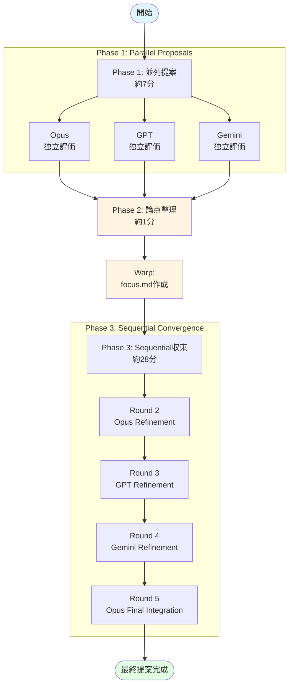
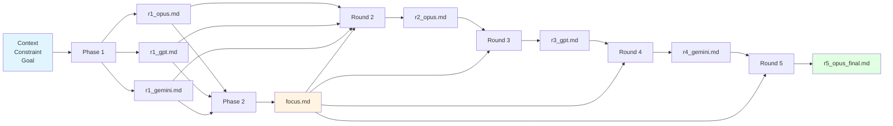

# Multi-Model Debate (MMD) Protocol

> 複数のLLMモデルを使用した対話的収束プロトコル。
> 提案生成・調査・比較において、3モデルが段階的に議論を収束させる。

---

## 概要

### 目的
- MMR（Multi-Model Review）の「並列レビュー→統合」を拡張
- 提案生成・調査・設計比較で「対話的に収束」するフローを実現
- 3モデルの視点を段階的に統合し、バランスの取れた結論を導出

### MMRとの違い

| 項目 | MMR（レビュー） | MMD（議論） |
|:---|:---|:---|
| 目的 | 批判的レビュー | 提案・調査・比較 |
| フロー | 並列→統合（2ステップ） | 並列→論点整理→収束（3ステップ） |
| 人間介入 | なし（完全自動） | Phase 2で論点整理（Warp担当） |
| 所要時間 | 7分（並列実行） | 36分（7+1+28） |

### 実装状況
**Status: 実用レベル完成（2026-01-08）**

- ✅ 基本実装完了（Phase 1/2/3）
- ✅ 統合テスト完了（MMD自身の品質評価で検証）
- ✅ P0/P1問題修正完了（MMDが自己発見・自己修正）
- ✅ 歯止め設計完了（Phase 3での勝手な実装防止）
- 🔄 複数題材での動作検証（今後）

---

## システムフロー

### 全体フロー



### データフロー



---

## アーキテクチャ

### Hybrid設計（Bash + Python）

2026-01-08の試行で、以下のパターンが最も現実的と実証された。

### 3つのPhase

#### Phase 1: 並列提案（7分）
- 3モデル（Opus/GPT/Gemini）が独立に提案
- **並列実行を基本とする**（MMRと同様、8割以上成功実績）
- 順次実行（21分）はフォールバック（Warpセッション不安定時）

#### Phase 2: 論点整理（1分）
- Warp（Sonnet）が3モデルの出力を読み、`focus.md`を作成
- 対立軸・収束方向を明示
- 人間の介入は最小（Warpに指示するのみ）

#### Phase 3: Sequential収束（22分）
- Opus → GPT → Gemini → Opus（最終統合）の順で、前モデルの出力を読み反応
- `focus.md`の収束方向に従い、段階的に統合
- **Opusが最終統合案を出力**（Round 5）
- **重要**: Phase 3は評価・提案のみ。コード変更・コミット・PR作成は禁止

---

## 実証結果（2026-01-08試行）

### 題材
MMDプロトコル自体の設計（メタな題材）

### 論点
1. Phase 2（論点整理）のフォーマット
2. スクリプト設計
3. 既存MMRスクリプトとの関係

### 最終決定事項

#### 論点1: Phase 2フォーマット
**決定: Option B（構造化テンプレート）**

全モデル一致。以下の3要素を必須とする：
```text
Context: {議論の背景・目的}
Constraint: {順守すべき制約事項}
Goal: {完了条件・成果物定義}
```

#### 論点2: スクリプト設計
**決定: Bashオーケストレーション + Pythonテキスト処理（Hybrid）**

- **Bash (`multi-model-debate.sh`)**: プロセス制御・並列実行・ファイルI/O
- **Python (`mmd/processor.py`)**: Prompt生成・JSON解析・エスケープ処理

**理由**:
- Opusの「既存MMR実績（Bash）」を尊重
- Gemini/GPTの「テキスト処理堅牢性（Python）」を吸収
- 適材適所の初期構成（段階的移行ではない）

#### 論点3: MMRとの関係
**決定: 完全分離 + 共通ライブラリ（`lib/parallel_executor.sh`）+ state.md共通化**

- **MMR（既存）**: 一切変更しない（安定性保護）
- **MMD（新規）**: 共通ライブラリを使用
- **共通化**:
  - 並列実行ロジック（`wait`, `trap`, エラーハンドリング）のみ切り出し
  - state.mdによる背景知識共有機構（MMRと同様）

---

## 実装ステップ

### Step 1: 共通基盤作成
```bash
scripts/lib/parallel_executor.sh
```
- 並列実行制御（バックグラウンド起動・wait-all・失敗集約）
- trap cleanup（Ctrl+C時の孤児プロセス防止）
- stderr分離（Markdown汚染防止）

### Step 2: Python処理層実装
```bash
scripts/mmd/processor.py
```
- Option Bテンプレートの適用
- 前ラウンド出力の解析
- プロンプト生成（エスケープ処理含む）

### Step 3: 統合スクリプト実装
```bash
scripts/multi-model-debate.sh
```
- Phase 1: 並列提案（`lib/parallel_executor.sh`使用）
- Phase 2: 論点整理（Warpが`focus.md`作成）
- Phase 3: Sequential収束（Opus→GPT→Gemini→Opus最終統合）
- Phase 4: 最終統合（Geminiの出力を確認）

---

## 実装詳細

### 完了済み ✅

#### Step 1: 共通ライブラリ（2026-01-08）
- ✅ `scripts/lib/parallel_executor.sh` 作成完了
- ✅ 並列実行制御（バックグラウンド起動・Wait-All戦略）
- ✅ trap cleanup（Ctrl+C時の孤児プロセス防止）
- ✅ stderr分離（Markdown汚染防止）
- ✅ P0/P1修正（escape不整合、二重wait問題）

#### Step 2: テキスト処理層（2026-01-08）
- ✅ `scripts/mmd/processor.py` 実装完了
- ✅ Option Bテンプレート適用（Context/Constraint/Goal）
- ✅ state.md対応（背景知識共有、MMRスタイル）
- ✅ 前ラウンド出力の統合
- ✅ エスケープ処理（Phase 1のみ使用）

#### Step 3: 統合スクリプト（2026-01-08）
- ✅ `scripts/multi-model-debate.sh` 実装完了
- ✅ Phase 1: 並列提案（3モデル同時実行）
- ✅ `--state` オプション対応（背景知識ファイル指定）
- ✅ Phase 3: Sequential収束（4ラウンド）
- ✅ 歯止め設計（Phase 3での実装禁止）

#### 検証（2026-01-08）
- ✅ 統合テスト完了（MMD Protocol自身の品質評価）
- ✅ P0問題2件の自己発見・自己修正を実証
- ✅ 全フロー（Phase 1→2→3）動作確認

### 今後の改善候補
- Phase 2の自動化（現状は手動でfocus.md作成）
- 複数題材での動作検証
- エッジケースのエラーハンドリング強化

---

## 使用方法

### 基本的な使い方

#### シンプルな議論（state.mdなし）

```bash
# Phase 1: 3モデル並列提案
./scripts/multi-model-debate.sh \
  "GTJ v2のKnowledge保存条件の代替案を3つ提示せよ" \
  "既存仕様（2条件）を尊重しつつ、実用性を優先すること" \
  "各代替案について、メリット・デメリット・推奨度を明示せよ"

# Phase 2: 論点整理（Warpに指示）
# 人間: 「3モデルの評価を読んでfocus.mdを作成して」
# Warp: focus.mdを作成

# Phase 3: Sequential収束
./scripts/multi-model-debate.sh --phase3

# 結果確認
cat /tmp/warp-mmd/responses/r5_opus_final.md
```

#### 複雑な議論（state.mdあり）

**推奨**: 複雑な題材、詳細な背景知識が必要な場合

```bash
# state.md作成（ExternalMonitoring RBA自動化の例）
cat > /tmp/exmon-state.md << 'EOF'
# ExternalMonitoring 概要
- 3リージョン外形監視（ap-northeast-3, us-west-2, eu-west-1）
- SLO: 99.9% (ダウンタイム月間4分)
- 現行の手動フロー: PagerDuty Incident → Ack → EC2再起動 → Resolve

# 現状の問題
- 手動対応に10〜15分かかる
- 深夜対応が負担
- 人的ミスのリスク
EOF

# Phase 1: state.mdを使用して議論
./scripts/multi-model-debate.sh \
  --state /tmp/exmon-state.md \
  "RBAによるメモリ逼迫対応の自動化" \
  "既存手動フロー3〜5を置換、SLO 99.9%を維持" \
  "Automation Actions起動からResolveまでの詳細フロー設計"

# Phase 2・3は同様
```

### 引数

**Phase 1モード**:
```bash
# シンプル
./scripts/multi-model-debate.sh <context> <constraint> <goal>

# state.mdあり（推奨）
./scripts/multi-model-debate.sh --state <file> <context> <constraint> <goal>
```
- `--state <file>`: 背景知識・詳細コンテキストファイル（optional, MMR state.md相当）
- `context`: 議論の背景・目的（簡潔に）
- `constraint`: 順守すべき制約事項
- `goal`: 完了条件・成果物定義

**Phase 3モード**:
```bash
./scripts/multi-model-debate.sh --phase3
```
- 前提: Phase 1実行済み、focus.md作成済み

### 出力ファイル

```
/tmp/warp-mmd/
├── focus.md                    # Phase 2: 論点整理
└── responses/
    ├── r1_opus.md              # Phase 1: Opus独立評価
    ├── r1_gpt.md               # Phase 1: GPT独立評価
    ├── r1_gemini.md            # Phase 1: Gemini独立評価
    ├── r2_opus.md              # Phase 3 Round 2
    ├── r3_gpt.md               # Phase 3 Round 3
    ├── r4_gemini.md            # Phase 3 Round 4
    └── r5_opus_final.md        # Phase 3 Round 5（最終）
```

---

## 注意事項

### Warpセッション安定性
- **Phase 1並列実行**: 3モデル×7分＝20分超でWarpセッションがクラッシュするリスクあり
- **Phase 3**: 4ラウンド（Opus→GPT→Gemini→Opus）で約28分（各7分）
- **対策**: 順次実行（21分）をフォールバック。ただし並列実行の成功率は8割以上（MMR実績）
- **判断基準**: 時短メリット（7分 vs 21分）が大きいため、基本は並列実行を推奨

### Phase 2の役割
- **人間（ユーザー）**: Warpに「論点整理して」と指示するのみ
- **Warp（Sonnet）**: 3モデルの出力を読み、`focus.md`を作成
- **所要時間**: 約1分（実測）

### Phase 3の制約
- **評価・提案のみ**: コード変更、コミット、PR作成は禁止
- **理由**: Phase 3は議論収束の場であり、実装判断は人間が行う
- **実装**: 各Round（R2-R5）のConstraintに明示的な禁止事項を追加済み

### MMRとの共存
- MMRは既存の安定稼働ツール（週次運用で定着）
- MMDはこれから試行錠誤する実験的ツール
- **完全分離を維持**し、MMRの安定性を脅かさない
- **state.mdは共通化**: MMRのstate.mdと同じ形式で背景知識を共有可能

---

## 参照

- MMRプロトコル: `docs/multi-model-review-protocol.md`
- MMRスクリプト: `scripts/multi-model-review.sh`
- 試行セッションログ: `/tmp/warp-mmd-trial/` (2026-01-08)
- Warp CLI Docs: https://docs.warp.dev/developers/cli
